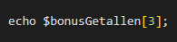

# Blok 3

## Installaties

### Visual Studio Code

Wij gebruiken bij dit vak het softwareprogramma Visual Studio Code ook wel VS Code. Dit is een gratis programma van Microsoft.

Je kunt VS Code hier downloaden: <https://code.visualstudio.com/>

#### **Opdracht 1: Download en installeer VS Code**

### Docker

Dynamische webpagina’s hebben verschillende softwareprogrammaatjes nodig om te kunnen draaien. Je hebt een webserver nodig die pagina’s verwerkt en serveert en je hebt een databaseserver nodig. Dit gaan we bewerkstelligen met Docker.

Docker is een virtualisatietechniek zonder dat we een hele Operating System nodig hebben.

Je kunt Docker hier downloaden: <https://www.docker.com/>

#### **Opdracht 2: Download en installeer Docker**

Met Docker gaat jouw computer (host) communiceren met containers waar de benodigde software staat. In dit geval een webserver en een databaseserver.

De containers worden gestart uit *images*. Deze images dien geïnstalleerd te worden. Dit gaat heel gemakkelijk want wij bieden een bestand aan waarin deze images staan. Het zal bijna geheel automatisch gaan. Daarover later meer…

Laat aan je docent zien dat je Docker kunt starten

### Git

We gaan ook werken met GIT. Git is een versiebeheer programma om de verschillende versies bij te houden van je code en ontwikkeling. Git kan heel ingewikkeld overkomen in het begin. We gaan eenvoudig beginnen.

Een aantal termen die de komende tijd voor bij komen zijn, *commit, push, pull, clone, repository*  en misschien nog een paar.

Software schrijven doe je soms alleen maar ook vaak in een team. Als je alleen werkt, kun je in principe gemakkelijk voor jezelf bijhouden wat de laatste versie is van je werk. Een methode die veel gebruikt wordt is het toevoegen van een versienummer aan de bestandsnaam (zoals bij Microsoft Office documenten: \`document_v1.docx\`, \`document_v2.docx\`, etc).

Dit werkt prima als je de enige bent die aan iets werkt en je binnen een enkel bestand bezig bent, maar zodra je werkt aan een project waarbij meerdere bestanden samen één versie vormen, wordt het al lastiger. Als je op een slimme manier wilt samenwerken met anderen, wordt het nog lastiger.

Dit is natuurlijk een probleem dat elk softwareontwikkelingsteam ervaart en dus zijn er in de loop van tijd verschillende systemen bedacht om hiermee om te gaan. Het versiebeheersysteem dat op dit moment het meest gebruikt wordt is [Git](https://nl.wikipedia.org/wiki/Git_(software))

#### **Opdracht 3: Installeer Git op je computer**

Je dient GIT te installeren op je PC. Dit doe je door naar <https://git-scm.com/> te gaan en te klikken op de afbeelding:

Er wordt veel gevraagd tijdens de installatie, zolang je niet zeker bent van wat de juiste keuze is: kies de aangeraden (recommended) opties.

### Terminal

Open een terminal in VS Code op je computer. Type het volgende commando in:

(vervang *mona lisa* voor je eigen gegevens)

git config --global user.name "Mona Lisa"

en daarna

git config --global user.email "mona@Lisa.com"

### Github

Op GitHub.com ga je al je projecten *opslaan.* Je kunt op deze site ook samenwerken met collega’s.

#### **Opdracht 4: Maak een account op Github.com.**

1.  Zorg voor een professionele username
2.  Je kunt je schoolmail gebruiken maar je mag ook je persoonlijke mail gebruiken

Repositories

Tijdens deze lessenserie maken we gebruik van een code die op github staat. We werken met verschillende opdrachten deze opdrachten staan vaak op github. Denk aan starterscode en software dat nodig is per project. Deze projecten noemen we repositories (repo in het kort). Deze repo’s gebruiken we veel.

We maken gebruik van de volgende repositories:

-   <https://github.com/NOVA-college-Haarlem/mijn-eerste-project>

## Technieken

### PHP

We gaan tijdens dit vak werken aan dynamische websites. Elke bezoeker van je website wil je als een soort klant gaan zien. Elke bezoeker is een gebruiker van je site. Met HTML kon een gebruiker alleen je site bekijken en doorheen klikken.

Met PHP ga je informatie van een gebruiker opslaan, je laat gebruikers inloggen en uitloggen, registeren en eventueel zaken aanmaken zoals producten, gerechten of andere dingen. We gaan controles uitvoeren wie er is ingelogd en wie niet. Sommige pagina’s ga je afschermen en je gaat data uit een database halen.

TL;DR; Je gaat **dynamische** **websites** maken met PHP en SQL.

### SQL

SQL is een *database* taal waarmee je data kunt opslaan, verwijderen, bekijken en updaten. Ook ga je databases en tabellen en kolommen maken.

### PHP vs. HTML (CSS)

Je bent waarschijnlijk gewend om een HTML-pagina (index.html) te coderen en deze met een dubbele klik van je muis te openen in je browser. Lekker makkelijk.

Met PHP kan dit niet. PHP is een **backend** **taal** en om de code hiervan ‘te runnen’ (parsen) heb je een server nodig. Deze **server** serveert de pagina’s naar de browser toe op het moment dat het nodig is.

### URL

Als je in je browser een adres intypt in de adresbalk dan vraag je aan een server een pagina op, bestaat de pagina dan wordt de gevraagde pagina getoond:

Vergelijk het eens met een ober in een restaurant: Je vraag om een ice tea. De ober geeft aan dat ze dat verkopen en serveert de ice tea aan je uit.

### Webserver

Dit is hetzelfde met een webpagina. Je vraagt een specifieke site of pagina (via de adresbalk) en de **webserver** serveert de pagina. Als de pagina niet bestaat dan krijg je een 404 error.

Alle sites van het world wide web draaien op servers van **hostingsproviders.** Omdat jij tijdens je opleiding gaat oefenen met websites bouwen heb je ook een webserver nodig. Je hebt geen echte hostingsprovider nodig. Echter kun je dit heel gemakkelijk nabootsen.

## Voordat je verder gaat

### Een projecten map

#### **Opdracht 5: Maak een projecten map**

1.  Maak via Explorer (verkenner) een map aan voor **ALLE** projecten. Bijvoorbeeld op deze plek:

    This PC \> Document \> Projecten

    

    Maak **geen** projecten op ONEDRIVE!!

    *(git en onedrive zijn geen vrienden)*

## Een project beginnen

### Project Forken

Je gaat aan verschillende projecten werken. Wij gaan elk project een eigen webserver geven, inclusief databaseserver. De code hiervoor staat op GitHub.

Op Github staat een repository die je moet **forken** **naar je eigen account.**

#### **Opdracht 6: Fork een repo**

1.  Login in bij Github.com
2.  Ga naar: <https://github.com/NOVA-college-Haarlem/mijn-eerste-project>
3.  Klik op FORK (rechtsboven)

    

4.  Hernoem de repository naar de naam van het project dat je gaat beginnen, bijvoorbeeld *formula1* , of *mijn-eerste-project* maar dit is voor elk project weer anders

    

5.  Klik op Create Fork
6.  Ga nu naar je eigen Github Account. De repository staat nu bij je eigen repositories.
7.  Open de repo onder je eigen account

### Project Klonen

Hiervoor heb je het project *gekopieerd* naar je Github account. Nu gaan het project naar je laptop/computer brengen door te klonen:

#### **Opdracht 7: Kloon project**

1.  Kloon de repo die onder jouw eigen Github account staat nu naar je eigen computer
    1.  Klik op de groene knop

        

    2.  Klik op de kopieer knop
2.  Open VS code
3.  Open de **projecten map** in VS code (of in de terminal)
4.  Klik op “Yes, I trust the authors”

    

5.  Je gaat nu je GitHub Repository klonen via de terminal
6.  Open de terminal:

    

    

7.  In de terminal kun je commando’s opgeven.
8.  Type het volgende in:

    git clone [https://github.com/\<jouw github username\>/mijn-eerste-project](https://github.com/%3cjouw%20github%20username%3e/mijn-eerste-project)

    ****

9.  Druk op Enter

    

10. Nu wordt het project van je *remote* repo gekloond naar je *local* repo in de projecten map
11. Je hebt nu de bestanden (en de geschiedenis) van het project op je eigen machine staan:

    

## Aan de slag met het project

Zorg ervoor dat je alleen het project hebt geopend waarin je gaat werken. Open dus NIET de gehele projectenmap in VS Code

| Dus niet                                        | Maar wel                                        |
|-------------------------------------------------|-------------------------------------------------|
|  |  |

### Servers starten

Als je Docker correct hebt geïnstalleerd dan kun je met behulp van het bestand *docker-compose.yaml* en de terminal de web- en databaseserver starten.

#### **Opdracht 8: servers starten (stoppen)**

1.  Start Docker Desktop vanuit je Windows start menu
2.  Zorg ervoor dat je dus alleen het project waaraan je gaat werken geopend hebt in VS Code
3.  Geef het volgende commando op in je terminal: *docker compose up*
4.  De servers zijn gestart

    Je kunt de terminal nu sluiten. (niet op de prullebak klikken, maar wel op het kruisje)

5.  Als je klaar bent met coderen of je wilt een ander project starten dan kun je het beste de **servers stoppen**. Dit kan op twee manieren:
-   In de terminal met de sneltoets: CTRL+C
-   Of Via Docker Desktop: klik op de stopknop

    

### Je site bekijken

#### **Opdracht 9: project in browser**

1.  Open je internet browser
2.  Ga naar: <http://localhost>
3.  Je ziet nu een overzicht van alle PHP instellingen

### Database beheer

#### **Opdracht 10: Databasebeheer starten**

1.  Open een nieuw browser tabblad en ga naar: http://localhost:8000
2.  Deze laatste link zorgt ervoor dat het webprogramma phpmyadmin geopend wordt. Hiermee kun je databases beheren.

## Coderen

In de map **www** kun je bestanden zetten waarmee we gaan werken. Net als bij html en css lessen kun je gewoon bestanden plaatsen met de gewenste extensie. De webserver zal ze gebruiken als je dat nodig acht.

### index.php

Als je een html pagina maakt dan gebruik je HTML en CSS code en bestanden met een extensie die eindigen op **.html** en bij CSS op **.css**

PHP bestanden eindigen met de extensie **.php  
**Het belangrijkste en EERSTE bestand dat de webserver serveert is altijd de **index.php**

### PHP Tags

En net als bij HTML heb je bij PHP een openingstag en een sluit tag:

Binnen deze tags kun je PHP-code schrijven. *Als je enkel en alleen php in je code hebt staan dan vervalt automatisch de php-sluit-tag*

#### **Opdracht 11: echo**

In de map *mijn-eerste-project*  staat al een bestand genaamd *index.php*. Hier zie je alleen een openingstag staan en een functie *phpinfo()*. Dit *index.php* bestand gaan we de komende opdrachten gebruiken voor alle opdrachten (tot en met opdracht 15)

1.  Haal phpinfo() weg en laat de openingstag staan
2.  Schrijf eens de volgende code in het bestand *index.php*, met echo kun je een tekst (string) tonen in de browser.

****

### Project bekijken

Zoals je eerder las kun je niet dubbel klikken op het bestand om het resultaat van je code te bekijken. Maar hoe dan wel?

Open je browser en type in de adresbalk:

<http://localhost/index.php>

Als je alle stappen gevolgd hebt dan zie je dit:

### HTML

Zie je dat de titel van je pagina gelijk is aan het adres. Dit kunnen we heel eenvoudig wijzigen. Je weet misschien dat je met \<head\> en \<title\> een titel kunt toevoegen aan je webpagina. Maar hoe doe je dat nou in php? Nou zo:

#### **Opdracht 12: HTML-template gebruiken**

Dan krijg je dit:

Je kunt dus een gehele webpagina maken in een .php bestand. En daarin kun je door de php-tags te gebruiken weer php code in verwerken. Kijk maar eens naar bovenstaande code. In de \<body\> staat php code.

Let op dat je hier wel de php-sluit-tag gebruikt: **?\>**

### Variabelen

In PHP bestaan uiteraard ook variabelen. Deze declareer je met een dollar teken (staat onder getal 4 van je toetsenbord)

We coderen een variabele als volgt

Let op! Altijd 1 **=** teken gebruiken bij declareren.

### Opnieuw declareren

De variabele heeft nu de waarde “The Simpsons”. Totdat je deze opnieuw ´vult’ met een andere waarde. Dan bestaat de vorige waarde (The simpsons) niet meer. Houd hier rekening mee. De laatst gevulde wordt onthouden door je server. (zolang je op de pagina blijft, hierover later meer)

Je ziet dat bij het declareren van een variabele de regel eindig met een puntkomma. Dit is verplicht met PHP. Goed opletten dus.

We kunnen de waarde van een variabele op het scherm tonen en dan bekijken in de browser

#### Opdracht 13: Coderen

Maak in het bestand *index.php* drie variabelen: \$voornaam, \$achternaam en \$leeftijd

Vul deze variabelen met jouw gegevens en echo deze op het scherm.

### Broncode

#### **Opdracht 14: Bekijk de broncode**

Misschien heb je dat al gedaan tijdens de voorgaande blokken (lessen). Je kunt je HTML en CSS code in je browser bekijken via de broncode. Klik eens in je browser met je rechtermuisknop en kies in het menu dan Bekijk broncode (view pagesource)

Je ziet Family Guy staan en misschien ook je eigen gegevens. Je ziet helemaal geen variabele en PHP tags staan. Dat komt omdat de server de code heeft *afgehandeld* en daarna het eindresultaat van die code serveert.

*Uiteraard had je de broncode ook via de Chrome DevTools kunnen bekijken.* **

### HTML in PHP

Je kunt ook HTML tags schrijven in PHP. Met HTML kun je tenslotte webpagina’s opmaken (**H**yper **T**ekst **Markup L**anguage).

#### **Opdracht 15: HTML in PHP**

1.  Neem onderstaande code over in index.php en bekijk je browser

Bijvoorbeeld zo:

****

Wat zie je nu in je browser?

1.  Bekijk eens de DevTools, je ziet wel de H1 Tags maar niks van PHP.

## PHP

### Condities

Je kunt uiteraard ook in PHP werken met condities om een keuze te maken op basis van een voorwaarde. **Het blokje code wordt pas uitgevoerd als het resultaat van de conditie TRUE is.**

#### Opdracht 16a: Condities

Of met twee voorwaardes,

Het blokje code wordt pas uitgevoerd als het resultaat van **beide** **condities** TRUE is.

1.  Maak een nieuw bestand aan genaamd condities.php
2.  Neem onderstaande code over en bekijk je browser via http://localhost/conditites.php

    

3.  Verander eens de geboortedatum een aantal keer. Zie je de tekst nog steeds?

In PHP bestaan er ook if-else statements. Dit betekent dat als de voorwaarde (conditie) in de if statement false is, automatisch het else gedeelte wordt uitgevoerd.

### Conditionele operatoren

Deze operatoren ken je misschien al…

| Vergelijking             | Operator |
|--------------------------|----------|
| Is gelijk aan            | ==       |
| Is groter dan            | \>       |
| Is groter of gelijk aan  | \>=      |
| Is kleiner dan           | \<       |
| Is kleiner of gelijk aan | \<=      |
| Is niet gelijk aan       | !=       |

#### Opgave 16b: Test je kennis

Schrijf een PHP-programma in **score.php** dat de cijfers van een student evalueert en weergeeft op basis van hun score met behulp van een Nederlands beoordelingssysteem. Het beoordelingssysteem ziet er als volgt uit:

-   Uitstekend: 90-100
-   Goed: 80-89
-   Voldoende: 70-79
-   Matig: 60-69
-   Onvoldoende: Minder dan 60

    **Vereisten**

1.  Maak een PHP-script dat een variabele \$score definieert en deze een waarde toekent tussen 0 en 100 (inclusief).
2.  Gebruik if-statements om de beoordeling te bepalen op basis van de waarde van \$score.
3.  Toon zowel de score als de overeenkomstige beoordeling volgens het opgegeven beoordelingssysteem.

    **Hints**

-   U kunt de echo-verklaring gebruiken om berichten en variabelen weer te geven.
-   Gebruik meerdere if-verklaringen of if-else if-verklaringen om de score te vergelijken met elk beoordelingsbereik.

    **Voorbeelduitvoer:**

    Score: 85

    Beoordeling: Goed

    Score: 45

    Beoordeling: Onvoldoende

### Arrays

Ook in PHP bestaan er arrays, die schrijf je zo:

Een array is een lijstje met waardes. De waardes kun je ophalen via de positie in de array. Deze positie noemen we de index of key.

1-Dit plaatje met arrays wordt gebruikt in de onderstaande uitleg

Onthoud dat de eerste positie in een array altijd nul (0) is. Dus als je de waarde **32** uit de eerste array (zie plaatje hierboven) wilt tonen in de browser dan doe je dit:

| Code                                            | Browser                                         |
|-------------------------------------------------|-------------------------------------------------|
|  |  |

Als je de boolean TRUE op het scherm wilt tonen uit de \$mijnGegevens array dan doe je hetzelfde:

| Code                                                                                                      | Browser                                                                                                                                  |
|-----------------------------------------------------------------------------------------------------------|------------------------------------------------------------------------------------------------------------------------------------------|
|  |  Een boolean is voor de computer altijd een 0 of een 1. Daarom zie je een 1 in de browser |

#### Opdracht 17: Arrays

1.  Maak een bestand aan genaamd arrays.php
2.  Neem de code van de \$mijnGegevens array over
3.  Toon alle waardes op het scherm met **echo**
4.  Bekijk in je browser: htttp://localhost/arrays.php

Als je vanuit een meervoudige array een waarde, bijvoorbeeld 3, op het scherm wilt tonen dan dien je eerst de eerste array binnen de *parent* array aan te wijzen: \$meerVoudigeArray[0] om daarna de waarde van de *child* array te nemen.

| Code                                            | Browser                                         |
|-------------------------------------------------|-------------------------------------------------|
|  |  |

Om een waarde van een array te wijzigen of te initiëren kun je het volgende doen:

Doordat je een =-teken gebruikt *vul* je de array op plek 3 opnieuw. De vorige waarde is vergeten.

### Associatieve arrays

Er bestaan in PHP ook arrays waarvan de index (de locatie binnen een array) niet bepaald wordt door een integer (geheel getal) maar door een string, dus “iets met aanhalingstekens”.

Dat ziet er bijvoorbeeld zo uit:

Als je een waarde (dat wat rechts staat van het =-teken) wilt tonen in de browser dan codeer je dit:

#### Opdracht 18: associatieve array

1.  Schrijf onderstaande code in arrays.php
2.  Maak eens een array genaamd \$mijnGegevens
3.  Noteer je voornaam, achternaam en leeftijd in de array.
4.  Toon de gegevens in de browser met echo
5.  Bespreek je code met de docent

#### Opdracht 19: spongebob

1.  Maak een nieuw bestand genaamd: spongebob.php
2.  Schrijf de onderstaande array over

    

Figuur 2 - Je ziet dat hier de array keys en values worden gescheiden door een pijl =\>. Deze schrijfwijze is beter?

1.  Toon de gegevens van Spongebob op het scherm
2.  Toon overige vier karakters, netjes op het scherm.

#### Opgave 20: best soccer players

1.  Maak een bestand genaamd: fifa.php.
2.  Kies een goalkeeper uit onderstaande array en toon zijn gegevens op het scherm:”

    

3.  Kies een verdediger en toon zijn gegevens op het scherm
4.  Kies een middenvelder en toon zijn gegevens op het scherm
5.  En uiteindelijk. Kies de beste aanvaller en toon zijn gegevens op het scherm.

### Foreach Loops

Je bent vast al bekend met verschillende loops in een andere programmeertaal. In PHP bestaan ze ook, de for-loop en while loop. Wij gaan tijdens deze periode werken met de foreach loop. Die ziet er zo uit:

### Foreach met enkel toegang tot de Waarde (value)

Je ziet dat de gehele array op de eerste plek in de foreach loop is geplaatst en de naam van een variabele op de tweede plek. Deze variabele wordt elke *iteratie* (loop) gevuld met een nieuwe waarde van de array \$fruits

#### Opdracht 21: Artiesten

1.  Maak een artiesten.php bestand
2.  Schrijf de \$artiesten array over en toon deze op het scherm met een foreach loop en echo op het scherm.

Maar je kunt er ook een associatieve array van maken…

#### Opdracht 21: musicians

1.  Maak een musicians.php bestand
2.  Schrijf de \$musicians array over en toon de **genres** op het scherm met een foreach loop en echo op het scherm.

### Foreach loop met toegang tot Sleutel (key) en Waarde (value)

#### Opdracht 22: Loop Spongebob array

1.  Maak gebruik van de spongebob array uit spongebob.php
2.  Maak gebruik van een foreach loop.
3.  Aangezien de eerste waarde in deze array ook een array is, begin je met alleen de gegevens van Spongebob te loopen. Schrijf code die ervoor zorgt dat je de gegevens van alleen Spongebob op het scherm toont.

    **\$spongebob_main_characters["Spongebob"]** is een array waar je doorheen kunt loopen.

#### Opdracht 23 Loop de Best Soccer Array

1.  Maak gebruik van de best soccer player array
2.  Maak gebruik van een foreach loop
3.  Maak gebruik van de foreach loop om zo specifieke waardes uit die grote array te tonen op het scherm.
4.  Deze array bestaat uit een array met meerdere arrays. Kun je een manier bedenken om alle individuele waardes van deze array op het scherm te tonen. Tip: je dient meerder foreach loops te gebruiken

## Request Response Cycle

Elke keer als je een website bezoekt dan doe je een verzoek (request) aan de server. Je zegt eigenlijk “hoi, mag ik deze pagina en deze content van je hebben?” en dan krijg je, als het goed is antwoord (response): “Ja hoor dat mag, alsjeblieft!”.

Dit wordt ook wel de Request-Response Cycle genoemd. Dat ziet er zo uit:

1.  Vanuit de browser vraag je om een bestand. Dit kan een html of php bestand zijn. *(ook css en javascript bestanden worden zo opgevraagd).*
2.  De server vindt het bestand en gaat deze verwerken: iets uitrekenen, of gegevens opslaan of gegevens ophalen.
3.  Dan wordt er weer html van gemaakt
4.  Deze html wordt weer naar de browser gestuurd

PHP staat dus op de server en wordt afgehandeld op de server.

### Requests

Er bestaan verschillende soorten requests (verzoeken aan de server). Deze requests zijn onderdeel van **H**yper **T**ext **T**ransfer **P**rotocol (HTTP). HTTP**S** is de Secure versie daarvan. HTTP is een van de application layers van het Internet Protocol suite (TCP/IP).

De belangrijkste requests zijn

-   GET
-   POST

Vergelijk het weer eens met een ober. Er bestaan twee manieren om een bestelling te plaatsen in een café:

-   Via de ober
-   Via de beschikbare app (qr-code)

### GET request

Een GET request is een verzoek, vaak via de adressenbalk, waarmee informatie van een server verkregen kan worden. Je kunt hier via de adresbalk data meegeven om zo specifieke informatie op te vragen. Omdat het hier om URLs gaat kun je deze verzoeken bijvoorbeeld bookmarken (opslaan) om zo later er weer terug te keren.

### POST request

Een POST request is een verzoek, vaak middels een formulier, waarmee informatie naar de server toe wordt gestuurd om verwerkt te worden. Bij deze vorm wordt er geen data in de adressenbalk meegegeven. Deze is dus iets veiliger. Deze kun je ook niet bookmarken.

### Superglobal arrays

In PHP kun je uiteraard gebruik maken van de GET en POST requests.

Je bent inmiddels bekend met arrays. In PHP bestaan er speciale array, superglobals. Deze bestaan al en zijn altijd beschikbaar. Je hoeft ze dus niet te declareren. Deze superglobal arrays (lijstjes) zijn associatieve arrays, die worden *gevuld* op een bepaald moment met de respectievelijke requests. Zo bestaat er de \$_GET variabele bij een GET request.

Laten we eerst even oefenen:

#### Opdracht 24: Link twee pagina’s

1.  Maak twee pagina’s in de map van je project
    1.  select.php
    2.  show.php
2.  Schrijf de volgende code in de \<body\> van select.php.

Schrijf het volgende in show.php

Test je code uit.

Als het goed is dan zie je het volgende resultaat in show.php verschijnen na het klikken op iedere link.

Op show.php wordt de \$_GET array op het scherm getoond met de functie print_r()

De eerste link *(show.php)* toont het volgende resultaat:

De tweede link *(show.php?waarde1=Honderd)* toont het volgende resultaat:

De derde link *(show.php?waarde1=TweeHonderd&waarde2=Drie)* toont het volgende resultaat:

****

De vierde link *(show.php?waarde1=Snoop%20Dog&waarde2=Dr%20Dre)* toont het volgende resultaat

*Een link kan geen spatie bevatten. In plaats daarvan gebruiken we* **%20.** *De array bevat wel weer een spatie.*

Er kan dus een waarde meegegeven worden via een link (dus de adresbalk). Deze waardes worden genoteerd in de array \$_GET. Deze array kan de server (of jij als coder) uitlezen en gebruiken.

#### Opdracht 25: Maak een GET-request met je eigen gegevens

1.  maak een over-mij.php pagina.
2.  maak één link (GET request) waarmee je je eigen gegevens naar show.php stuurt
3.  Stuur je voornaam, achternaam en leeftijd Haal de print_r() uit show.php weg en toon alle waardes afzonderlijk

### 

## Ingebouwde PHP functies

In de codeer wereld en zeker in de wereld van het web is het belangrijk dat jij de waardes van variabelen controleert op inhoud. Stel nou dat de waarde van een variabele een integer moet zijn omdat je deze wilt opslaan in de database, bijvoorbeeld zoiets als huisnummer. Maar een gebruiker geeft een stuk tekst op in plaats van een getal, dan kunnen er fouten optreden. Daarom is het belangrijk dat je controles in je code uitvoert zodat de applicatie doet wat het moet doen. En is het niet het juiste datatype, dan dient de applicatie iets anders te doen. Het is belangrijk om te weten dat je niet alleen aan de voorkant van een applicatie deze controles uitvoert maar ook op de backend kant van je applicatie.

Een aantal ingebouwde PHP-functies zal hieronder toegelicht worden en deze dien je dus ook te gaan gebruiken in je code.

De eerste tabel zijn functies die een TRUE of FALSE teruggeven als antwoord.

| **Functie**  | **Toelichting**                                                                                                                                                                                                                                                                         |
|--------------|-----------------------------------------------------------------------------------------------------------------------------------------------------------------------------------------------------------------------------------------------------------------------------------------|
| empty()      | Deze functie controleert of een variabele leeg is. Een variabele wordt als leeg beschouwd als deze niet is gezet, of als deze één van de volgende waarden heeft: null, false, 0, een lege string of een lege array. De functie geeft true terug als de variabele leeg is, anders false. |
| isset()      | Deze functie controleert of een variabele is gezet en niet NULL is. Het geeft TRUE terug als de variabele bestaat en een waarde heeft die anders dan NULL is, en anders FALSE.                                                                                                          |
| is_null()    | Controleert of een variabele null is.                                                                                                                                                                                                                                                   |
| is_array()   | Controleert of een variabele een array is.                                                                                                                                                                                                                                              |
| is_string()  | Controleert of een variabele een string is.                                                                                                                                                                                                                                             |
| is_int()     | Controleert of een variabele een integer is.                                                                                                                                                                                                                                            |
| is_numeric() | Controleert of de variabele een getal is.                                                                                                                                                                                                                                               |

De tweede tabel geeft ook functies weer. De eerste twee geven informatie en de derde serveert een andere pagina.

| **Functie** | **Samenvatting**                                                                                                                |
|-------------|---------------------------------------------------------------------------------------------------------------------------------|
| print_r()   | Geeft de inhoud van een variabele weer in leesbare tekstformaat.                                                                |
| var_dump()  | Geeft de inhoud van een variabele weer, inclusief het type en de lengte van de variabele.                                       |
| header()    | Deze functie stuurt een HTTP-header naar de browser. Het wordt gebruikt om bijvoorbeeld de locatie van een pagina te veranderen |

#### Opdracht 26 – Ingebouwde Functies

Maak een nieuw PHP-bestand genaamd **functions-testing.php** en start met het opzetten van een basisstructuur voor een PHP-script.

Maak een aantal variabelen aan en bepaal of deze leeg zijn met behulp van empty(), gebruik ook var_dump()

\$naam= "";

\$leeftijd = 0;

\$isGetrouwd = false;

\$kinderen= array();

Dit moet je eindresultaat zijn:

Is de naam variabele leeg? bool(true)

Is de leeftijdsvariabele leeg? bool(true)

Is de isGetrouwd variabele leeg? bool(false)

Is de kinderen variabele leeg? bool(true)

#### Opdracht 27 – isset() of empty() functie

1.  Maak een bestand aan genaamd spongecheck.php
2.  Neem de onderstaande code over en toon het resultaat in de browser. Wat zie je? Fouten?!?
3.  Laat de code staan!! Voeg alleen code toe!!!
4.  In het commentaar van de code staat wat er van je verwacht wordt.

\$spongebob_characters = array(

"SpongeBob" =\> "A cheerful and optimistic sea sponge who lives in a pineapple under the sea",

"Patrick" =\> "SpongeBob's best friend, a dim-witted but friendly starfish",

"Sandy" =\> "A squirrel from Texas who lives in an underwater tree dome and is an expert in karate",

"Squidward" =\> "SpongeBob and Patrick's grumpy next-door neighbor and co-worker at the Krusty Krab",

"Plankton" =\> "The evil mastermind and owner of the Chum Bucket, who is constantly scheming to steal the secret formula for Mr. Krab's popular Krabby Patty burgers"

);

//Voordat je een echo uitvoert maak je eerst hier een check of de variabele bestaat

echo "SpongeBob is described as: " . \$spongebob_charaters["Spongebob"] . "\<br\>";  
  
// Voordat je een echo uitvoert check je eerst hier of de key van in de array wel bestaat  
echo "Mr Krabs is described as: " . \$spongebob_characters["Mr Krabs"] . "\<br\>";

## Werken met een Database (SQL)

### Database Connectie

Als je goed heb gekeken naar de afbeelding van de Request Response Cycle dan heb je gezien dat een PHP pagina kan communiceren met een database. Dat gaan we nu regelen. Er zijn verschillende manieren om dit te doen. Wij beginnen uiteraard met de eenvoudige wijze.

#### Opdracht 28 – FormulA 1

Om de beginnen heb je een nieuw project nodig. Je moet dus naar Github gaan en een project forken en daarna clonen.

Ga eens naar <https://github.com/NOVA-college-Haarlem/formula1-new>

Lees het bestand README voor de details.

1.  Maak een database aan met een herkanbare naam: formula1 of f1db
2.  Kopieer het bijgevoegde .sql bestand en zorg ervoor dat de sql queries uitgevoerd worden op de zojuist aangemaakte database. Er staat nu data in de database.

Heb je het vorige project al een keer gedaan (omdat je dit blok opnieuw doet) doe dan dit project:

<https://github.com/NOVA-college-Haarlem/mobile4you-store>

Je begint met het maken van een database.php bestand en je zet onderstaande code erin.

Vul bij \$dbname de naam in van de database die je gaat gebruiken. Geef je databasenaam altijd de naam van het project.

Je kunt de controleren of de connectie gelukt is:

Je dient uiteraard de instellingen aan te passen aan het project(je) waar je mee aan het werk bent

### Alle rijen ophalen

Nu je een succesvolle database connectie hebt moet je een query uitvoeren op de database tabel. Dit heb je al gedaan bij al je database lessen maar dan via PHPMYADMIN. Nu gaan we dat met PHP doen, je maakt bijvoorbeeld een pagina genaamd drivers_index.php

Op deze pagina maak je gebruik van de eerder gemaakte database connectie, door require functie te gebruiken. Dan schrijf je code om de query uit te voeren, zie hieronder:

****

Regel 7 bevat nu een variabele genaamd \$drivers. Dit is een **multidimensionale associatieve** array die we kunnen uitlezen met een var_dump() functie zoals op regel 9-11 gebeurt.

Commentaar regel 9-11 even uit en sluit php af:

Met een foreach loop in de body van de pagina kunnen we de lijst van drivers op een leesbare wijze tonen:

**  
**

#### **Data in Tabel Tonen**

In de vorige les hebben we voor het eerst een database connectie gemaakt. We gaan nu verder met dat project, Formula1

Ook heb je data opgehaald uit een tabel en deze getoond in de browser. Nu gaan we deze data mooier tonen

Bijvoorbeeld in een HTML-tabel.

Om veel data te kunnen tonen maken we vaak gebruik van een overzichtelijke tabel. In HTML heb je een table-tag die je kunt gebruiken. Een eenvoudige tabel codeer je zo

En dat ziet er dan zo uit:

Je kunt de tabel natuurlijk stijlen met CSS.

Dan ziet de tabel er zo uit:

We gaan nu verder met de data uit de database. Deze gaan we mooier tonen in een tabel.

In het voorbeeld hierboven staan in de bovenste rij de namen van de kolommen en daaronder de daadwerkelijke data.

Deze data moet uit de database komen. In de vorige les hebben we de data opgehaald en er een associatieve array ervan gemaakt. Daarna konden we met een loop de data tonen. Dezelfde techniek zetten we nu in bij de tabel

Met dit als eindresultaat:

Je kunt ook een andere schrijfwijze voor de foreach-loop gebruiken die leesbaarder is. Bekijk deze wijze goed:

****

### Enkele Rij ophalen

We gaan nu elke driver apart bekijken/een aparte pagina geven. Met bijvoorbeeld nog meer details (en later bijvoorbeeld afbeeldingen erbij).

Uiteraard gaan we niet voor elke driver een aparte pagina maken. We maken een pagina die voor elke driver hetzelfde zal zijn. We gaan dus een dynamische pagina maken met PHP.

| Stappenplan                                                                                                                  | Uitvoering                                                                                                                                                                                                                                                                                                                                            |
|------------------------------------------------------------------------------------------------------------------------------|-------------------------------------------------------------------------------------------------------------------------------------------------------------------------------------------------------------------------------------------------------------------------------------------------------------------------------------------------------|
| Hiervoor hebben we een paar zaken nodig: Een php-pagina Een database connectie Een sql query En het resultaat op het scherm  | driver-details.php We maken eerst een pagina, genaamd driver -details.php (let op! kleine letters) Database connectie Dan importeren we de eerder gemaakt database connectie door gebruik te maken van require SQL query Dan schrijven we de query die we nodig hebben: SELECT \* FROM drivers WHERE id = \$id; PHP-code Code om de data op te halen. |

Dit ziet er dan zo uit:

In \$driver *stoppen* we aan associatieve array met de gegevens van 1 enkele driver.

Vul de code eens aan met dit:

Typ daarna eens in de adresbalk: <http://localhost/driver-details.php>

Als je goed hebt opgelet is met deze code altijd de driver met een ID van 1. Dit is natuurlijk niet handig. Nu halen we alleen de info van de eerste driver op en tonen deze op het scherm.

### Dynamische link

We moeten ervoor zorgen dat de variabele \$id steeds veranderd. Dit kunnen we doen door een link te maken (GET-request) en dan de waarde van de gekozen driver mee te sturen met ons verzoek.

Ga eens terug in VS code naar drivers_index.php. Hier gaan we naast elke driver in het overzicht een link maken die verwijst naar driver-details.php

Dit doe je zo: 

Nu kun je naast elke driver op een link klikken. Je ziet bij de link **?id=1** staan. Dit betekent dat we de waarde 1 aan id toekennen. Deze waarde kunnen we *uitlezen* op de volgende pagina.

Zoals in de vorige opdrachten doen we dat met een \$_GET array. Zo:

In dit geval is de waarde nu **1**. Sterker nog de waarde van elke link is 1. Ook dit moeten we nog wijzigen. Dit kun je binnen de foreach loop wijzigen, de link moet dynamisch worden.

Als je alle stappen goed doorlopen hebt dan zie je dat je twee dynamische pagina’s gemaakt hebt met PHP, SQL, HTML en CSS.

### Afbeeldingen Toevoegen

Afbeeldingen kun je op twee manieren opslaan in een webapplicatie. De een is de afbeelding in de database opslaan. De andere wijze gaat via de webserver zelf. Net als de php bestanden zullen de .png en jpg bestanden ook geserveerd worden. In de database leggen we vast welke rij (record) bij welke afbeelding hoort. Hieronder lees je stapsgewijs hoe dat moet.

#### Opdracht 29: Voeg een afbeelding toe

1.  Voeg een extra kolom toe aan de database met phpmyadmin, genaamd *image*
2.  Download een afbeelding van een willekeurige driver, bijvoorbeeld Max Verstappen
3.  De afbeelding naam van Max Verstappen (max-verstappen.jpg) moeten we opslaan in de database
4.  Maak in de map www een nieuwe map aan genaamd *images*
5.  Zet de gedownloade afbeelding hierin en zorg ervoor dat de afbeelding dezelfde naam heeft.

#### Opdracht 30: Toon de afbeelding

1.  Op de detail pagina echo je de afbeelding door de volgende code te gebruiken

## Nieuw Project

#### Opdracht 31: Fork en Cloon

1.  Fork het project <https://github.com/NOVA-college-Haarlem/tools4ever>
2.  Cloon het project naar je eigen machine (IN JE PROJECTEN MAP)
3.  Kopieer de sql code uit het bestand tools.sql en voer deze uit op de database.

#### Opdracht 32: Index

1.  Open het project in VS Code
2.  Maak een pagina genaam tools_index.php
3.  Toon alle gereedschap op het scherm in een html tabel

#### Opdracht 32: Details

1.  Maak een dynamische link op tools_index.php
2.  Maak een detail pagina genaamd tools_details.php
3.  Toon de gereedschap netjes op het scherm

#### Opdracht 33. Afbeeldingen

1.  Zoek afbeeldingen voor minstens 5 stukken gereedschap
2.  Zet deze in de www/images map
3.  Maak een extra kolom aan image in de tools table
4.  Zorg ervoor de afbeeldingen getoond worden op de pagina tools_details.php