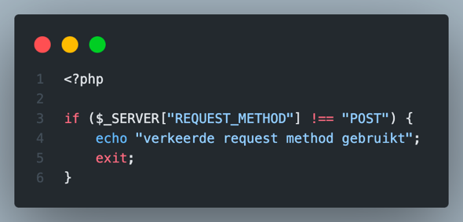
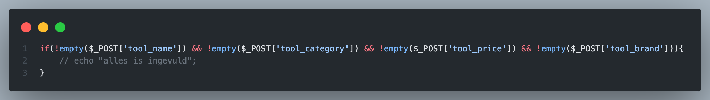

# Blok 4

## Data opslaan

Je hebt tot nu toe alleen data opgehaald. Veel rijen (records) met data en enkele rijen met data. Nu gaan we aandacht besteden aan het opslaan van data. Hiervoor hebben een aantal zaken nodig.

-   Database connectie
-   tools_create.php
-   sql query voor opslaan
-   bedankt bericht/pagina

### Formulier & POST-request

In het vorige blok heb je gewerkt met de GET-request methode. Dus verzoeken doen aan de server via een URL. Nu gaan we op een andere wijze verzoeken doen, met de POST-request. Deze wordt vaak gebruikt om data op te slaan of te bewerken. Ook zullen we werken met de $_POST-array.

De \$_POST array *vullen* we nu met een HTML formulier. Dus stel dat we gereedschap in de database willen opslaan. Dan maken we een HTML formulier waarmee een gebruiker de gegevens kan invullen.

We beginnen met de opening en sluit tag van een formulier:

Je ziet hier twee attributen: **action** en **method**.

-   De action-attribuut geeft de locatie van het verzoek aan ofwel waar wordt het formulier afgehandeld op de server, in dit geval in *tools_create_process.php*.
-   De method-attribuut geeft aan het type verzoek dat we gebruiken, in dit geval POST

Om een formulier te versturen met data moet er natuurlijk door de gebruiker data ingevoerd kunnen worden. Voor *tools4ever* zijn dat de volgende gegevens:

| Omschrijving     | Database kolom |
|------------------|----------------|
| Naam gereedschap | Tool_name      |
| Categorie        | Tool_category  |
| Prijs            | Tool_price     |
| Merk             | Tool_brand     |

Dit zouden we als volgt met HTML in het formulier kunnen zetten:

Hierbij is bij de tag **input** de attribuut **name** een belangrijke. Dit bepaalt de key in \$_POST array.

In het voorbeeld hierboven ziet dat er zo uit:

De overige velden voor het project *tools4ever* dienen ook ingevoerd te worden. Daarnaast zal het formulier pas verstuurd *nadat* er op een knop is geklikt. Dus we dienen de knop ook toe te voegen met een *name-attribuut.*

Het uiteindelijke formulier ziet er dan zo uit:

Dit ziet er dan zo uit:

We kunnen nu het formulier gaan testen door de gegevens te gaan invullen met onzin:

-   **Naam**: hamer
-   **Categorie**: slagwerk
-   **Prijs**: 10
-   **Merk**: bosch

Zodra je op de knop klikt doe je een verzoek aan de server om de pagina tools_create_process.php op te halen en terwijl je dat doet stuur je de ingevulde gegevens naar de server.

Maak nu een bestand aan genaamd *tools_create_process.*php en schrijf de volgende code over.

Een *gevulde* array! YES!

Vul nu eens de volgende gegevens in. Werkt het nog steeds??

-   Naam: 230 V Decoupeerzaag D-greep
-   Categorie: decoupeerzaag
-   Prijs: 131
-   Merk: Makita

Als je dit dan allemaal werkt dan kunnen we het formulier nog mooier maken door wat CSS toe te passen:

 

Ok. Mooi. We maken nu een POST-request met een formulier en daarbij sturen we data mee via de \$_POST array.

### Data controleren

Nu kunnen we beginnen met het controleren van de data die de server ontvangt. Dit doen we door gebruik te maken van de [ingebouwde functies](#ingebouwde-php-functies).

We willen controleren op.

1.  **Is de request een POST request / is er geen GET gebruikt?**
2.  **Is er op de knop gedrukt / is het formulier opgestuurd?**
3.  **Bestaan de verwachte keys uberhaubt / bestaan de door ons gecodeerde name-attributen?**
4.  **Zijn de values niet leeg zijn / is er data ingevoerd?**

De vier controles worden hieronder uitgelegd.

**Is de request een POST request / is er geen GET gebruikt?**

Als een gebruiker via de url naar het bestand tools_create_process.php gaat, dan wordt dit gedaan via een GET request en dat moet **niet** mogelijk zijn. En dus moet het programma dus stoppen.

Door gebruik te maken van de superglobal array \$_SERVER kunnen we controleren welk type request gebruikt is:

Als we deze voorwaarde omdraaien door een uitroepteken te gebruiken in de voorwaarde en het programma dan laten stoppen dan hebben we goed werkende code:

Zie je het uitroepteken **!**

*Als er geen POST request wordt gebruikt dan moet het programma stoppen.*

**Is er op de knop gedrukt / is het formulier opgestuurd?**

Je kunt controleren of de submit knop is ingedrukt door te checken of de submit key aanwezig is in de \$_POST array:

Of andersom als we een uitroepteken gebruiken:

**Bestaan de verwachte keys uberhaubt / bestaan de door ons gecodeerde name-attributen?**

Met de isset() functie kunnen we controleren of een variabelen bestaat. En ook of een key in een array bestaat.

****

Als geen van de keys aanwezig zijn dan moet het programma stoppen en dus zouden we dat ook zo kunnen opschrijven. Let op ALLE uitroeptekens en de *OR-tekens ( \|\| )* in onderstaande code.

**Zijn de values niet leeg zijn / is er data ingevoerd?**

Met de empty() functie kunnen we controleren of een variabele een waarde heeft, ofwel niet leeg is. Zie uitroepteken!

Of per veld een if-statement met een voorwaarde:

Als het veld leeg is dan laten we aan de gebruiker weten wat er gebeurt:

Als al deze if-statements doorlopen zijn (voorwaardes getest) dan gaan we werkelijk iets doen met de data.

We kunnen de \$_POST array lezen en variabelen *vullen.*

**

Als we de code dan combineren dan krijgen we dit:

Of dit:

### Data opslaan

Nu we de data uit het formulier hebben gehaald gaan we deze opslaan in de database. We gebruiken hiervoor de SQL query INSERT INTO.

De functie mysqli_query() geeft een boolean terug (return). Dus na het *runnen (uitvoeren)* van de functie komt er een boolean uitgerold, dus een TRUE of een FALSE. Door deze in een if statement te zetten kunnen we de gebruiker later weten dat het opslaan gelukt is:

Hieronder vind je alle code terug van het ophalen, controleren en opslaan van de data uit het formulier.

Of deze waarbij de logica is omgedraaid:

## Registreren

Veel applicaties bieden (toekomstige) gebruikers aan om zich te registreren. Dit gaan we nu ook bouwen. Een gebruiker registeren is eigenlijk een gebruiker opslaan in de database. Kortom, bijna dezelfde structuur als bij het opslaan van gereedschap.

#### Opdracht 34: users tabel

We hebben wel een *users* tabel nodig in de database. Hieronder vind je een schematische weergave van deze tabel, de ERD:

1.  Maak in phpmyadmin (<http://localhost:8000>) een tabel aan genaamd **users**
2.  Maak 9 kolommen aan, zie hierboven voor de details
3.  De laatste is een enum, de haakjes hoef je niet over te nemen.

Als je dat gedaan hebt gaan we met html en php aan de slag om het formulier te maken waarmee een gebruiker zich kan registeren.

#### Opdracht 35: Registratieformulier

1.  Maak een bestand aan genaamd **registration.php**
2.  Maak een HTML formulier met invulvelden. Maak invulvelden voor alle attributen van User. (zie ERD), denk aan de name-attributen. De is_active attribuut kun je met RADIO Buttons oplossen. De role attribuut kun je oplossen met een SELECT-tag.
3.  Maak een knop om het formulier te versturen, denk aan name-attribuut
4.  Stijl je formulier met CSS

#### Opdracht 36: Verwerk formulier

1.  Maak nog een bestand aan genaamd **registration-process.php**
2.  Schrijf hierin code die de gegevens uit het formulier **ophaalt**
3.  Schrijf daarna code om te **controleren of de gegevens bestaan**
4.  Schrijf code om te controleren of het formulier **volledig** **is ingevuld**
5.  Schrijf daarna code om de gegevens **op te slaan** naar de database

## Inloggen

Bij inloggen werkt het net andersom. We controleren of een gebruiker bestaat. Technisch gezien is dit hetzelfde als tools_details.php maar dan niet met een GET-request maar via een formulier en een POST-request.

#### Opdracht 37: Maak een formulier

1.  Maak een bestand genaamd **login.php**
2.  Maak een HTML formulier met invulvelden voor email en wachtwoord, denk aan name-attributen
3.  Maak ook een knop om het formulier te versturen
4.  Stijl met CSS je formulier

#### Opdracht 38: Verwerk formulier

1.  Maak een bestand genaamd **login-process.php**
2.  Schrijf hierin code die de gegevens uit het formulier **ophaalt**
3.  Schrijf daarna code om te **controleren of de gegevens bestaan**
4.  Schrijf code om te controleren of het formulier **volledig** **is ingevuld**
5.  Schrijf variabelen \$**email** en **\$password** om de data

Nu je zover bent gaan we de opgehaalde gegevens vergelijken met de gegevens die in de database opgeslagen zijn. En als de gebruiker de juiste gegevens heeft opgeven dan mag hij/zij/hen inloggen.

Hieronder volgt de uitleg hoe je dat kunt doen.

1.  SQL schrijven en laten uitvoeren
2.  Controleren of een gebruiker met het ingevulde emailadres is gevonden
3.  Is een gebruiker gevonden? Dan wachtwoorden met elkaar vergelijken
4.  Dan de gebruiker doorsturen naar een **dashboard.php**

**SQL schrijven en laten uitvoeren**

We schrijven een sql-query om een gebruiker te vinden met een specifiek emailadres. Zie hieronder hoe je dat schrijft.

**Controleren of een gebruiker met het ingevulde emailadres is gevonden**

Dee functie mysqli_num_rows() telt het aantal gevonden rijen (records) . En dus kunnen we controleren of er meer dan 0 gevonden zijn in een if-statement.

****

**Is een gebruiker gevonden? Dan wachtwoorden met elkaar vergelijken**

We zetten het resultaat \$result om in een associatieve array om zo de gegevens van de database en de gegevens die zijn ingevuld in het formulier met elkaar te vergelijken.

**Dan de gebruiker doorsturen naar een dashboard.php**

Met de functie **header()** kunnen we de gebruiker een nieuwe pagina server.

De volledige code staat hier:

## Levensduur van een variabele

Even eerst een klein uitstapje naar de levensduur van een variabele of array.

### Levensduur *Normale variabele*

De variabele \$voornaam is ALLEEN beschikbaar op de pagina waar die gedeclareerd is. Dus de levensduur van deze variabele is vrij kort, of **1 pagina**.

### Levensduur Request arrays

Stel dat we een variabele willen *overhevelen* naar een andere pagina, dan kunnen we zoals je weet gebruik maken een van de request-arrays: \$_POST of \$_GET. Hiermee kunnen we een waarde naar een andere pagina toesturen.

De levensduur van deze variabele is dus **2 pagina's**. Handig bij inloggen, registeren, aanmaken, opzoeken en dat soort zaken. Echter wordt deze variabele (voornaam) gewist op het moment dat we naar een volgende, een derde pagina gaan.

### Levensduur Session array

Er zijn superglobal arrays die **niet** **gewist** worden. Zoals \$_SERVER maar ook \$_SESSION. Deze variabelen blijven dezelfde keys en values houden totdat we het anders zouden coderen. De levensduur van deze arrays zijn min of meer oneindig.

Door gebruik te maken van de \$_SESSION array (een lijstje dus) kunnen we OP ELKE pagina controleren of een gebruiker is ingelogd.

We zorgen ervoor dat een gebruiker een sessie start. Deze sessie wordt na verloop van tijd weer gesloten. Denk bijvoorbeeld aan het starten van een game. Deze start je, je kunt spelen en scores behalen en dan op een gegeven moment is de game klaar en kun je een nieuwe game starten. Dit is ongeveer hetzelfde als bij een sessie.

Om dat te kunnen bewerkstelligen gaan we de \$_SESSION array eerst vullen om daarna te checken/controleren of deze gevuld is op een wijze die wij willen.

Om gebruik te maken van de \$_SESSION array moeten we deze eerst activeren. Dit doen we met de functie session_start().

Voor onze applicatie doen we dit nadat de gebruikersnaam/email en wachtwoord correct zijn ingevoerd en dus de gebruiker succesvol is ingelogd.

En aangezien we zelf mogen bepalen wat er in de sessie array aan key-namen komt te staan kunnen we bijvoorbeeld onderstaande code schrijven, waarbij je kunt zien dat we keys met Nederlandse namen opgeschreven hebben opgeschreven. De kolommen in de database zijn in het Engels.

**  
**

## Authenticatie

Als een gebruiker is ingelogd met de juiste gegevens dan moeten we ervoor zorgen dat hij/zij/hen naar de juiste pagina gestuurd wordt Dit kun je doen met de functie *header()*.

Een gebruiker is ingelogd. De gebruiker krijgt dashboard.php te zien. Mooi......maar niet helemaal...

*Als je de pagina* **dashboard.php** *nog niet gemaakt hebt dan dien je deze NU te maken.*

Want, wat weerhoud een gebruiker om meteen in de adresbalk (url) dashboard.php in de typen? Niks en dan kan iedere gebruiker bij de content van dashboard.php komen, ZONDER in te loggen. Dit moeten we zien te voorkomen.

We moeten controleren of een gebruiker is ingelogd. Maar hoe doen we dat....nou dat ga je hieronder lezen. (duh!)

Tot dusver hebben we een inlogfunctionaliteit gemaakt. Maar we moeten nu op elke pagina die we willen afschermen van pottekijkers bewerken met een controle-functionaliteit. We willen controleren of iemand is ingelogd.

Dat doen we aan de hand van de \$_SESSION array. Deze array is tenslotte aangemaakt en van sleutels en waardes voorzien op het moment dat de gebruiker inlogde.

Deze superglobal array kunnen we op andere pagina’s gebruiken*.* Net als bij het inloggen moeten we de session_array weer *oproepen* met de session_start() functie.

Dit kunnen we ook omdraaien. Als er geen user_id in de sessie is opgeslagen dan is er niet ingelogd en mag de gebruiker niet op dashboard.php aanwezig zijn.

Let op het uitroepteken !!

## Autorisatie

Elke gebruiker heeft een rol en hiermee kun je dus ook bepalen wat een specifieke wel of niet mag zien of gebruiken.

Aangezien we de rol uit de database tabel in de session array hebben gestopt kunnen we ook hier controles voor maken op specifieke pagina’s.

Met deze techniek kun je dus bijvoorbeeld elke rol specifieke pagina’s (of functionaliteiten) toekennen ofwel autoriseren.

*Later zul je leren dat je ook autorisatie kunt aanbrengen op permissie niveau i.p.v. rol niveau.*

## Zoeken

Je hebt de vorige lessen gewerkt met een formulier om een gebruiker of tool aan te maken. Daarnaast heb je ook een inlog functionaliteit gemaakt.

Nu gaan we een zoek functionaliteit maken. Hiervoor gebruiken we dezelfde technieken tot nu toe gebruikt zijn. Voornamelijk die van inloggen lijkt hierop.

Ten eerste maken we een formulier met html (css) om een zoekopdracht te kunnen maken op een pagina genaamd, **search.php**

****

Dan zorgen we dat het formulier *afgehandeld kan worden.* Dit kunnen we regelen op dezelfde pagina.

We controleren eerst of de knop is ingedrukt en het zoekveld bestaat.

(controleer altijd de input van je gebruikers!!)

#### Opdracht 39: Zoekformulier

1.  Neem de code over van de afbeelding hierboven op search.php

#### Opdracht 40: Controleer versturen

1.  Controleer of het formulier verstuurd is / is de knop ingedrukt?
2.  Controleer of het zoekveld is ingevuld
3.  Controleer of het zoekveld minimaal 3 tekens bevat. Gebruik de functie **strlen()**

#### Opdracht 41: Doorzoek database

1.  Importeer de database connectie
2.  Schrijf sql-code die op basis van de zoekterm gereedschap ophaalt met een bepaalde **naam**.

#### Opdracht 42: Toon de resultaten

1.  Nu je resultaten uit de database haalt kun je deze met een foreach-loop tonen op het scherm.
2.  Als je een niet-bestaande zoekterm invult wat krijg je dan te zien? Niks? Verbeter dit zodat de gebruiker weet wat er gebeurt
3.  Als je niks invult in het formulier, toon dan alle gereedschap uit de database.

#### Opdracht 43: Joker inzetten

1.  Bij SQL lessen heb je geleerd om in een query een placeholder/joker te schrijven. Codeer dit in je applicatie

## Dashboard data

Tot nu toe hebben we mooie functionaliteiten gebouwd in de applicatie. We kunnen er uiteraard nog een aantal aan toe voegen.

We gaan nu het dashboard uitbreiden met een paar statistieken.

### Is ingelogd?

Door de sessie array te gebruiken op het dashboard kunnen we aangeven wie er is ingelogd.

### Tijd weergeven

We kunnen bijvoorbeeld de huidige tijd weergeven op het dashboard.

### Tool data

Daarnaast kunnen we ook het aantal werknemers weergeven op het dashboard

#### Opdracht 44: Gemiddelde prijs totaal

1.  Schrijf code waarmee je het gemiddelde van de prijs van alle tools uitrekent en op het schermt toont

#### Opdracht 45: Gemiddelde prijs per categorie

1.  Schrijf code waarmee je de gemiddelde prijs per tool-categorie op het scherm toont

#### Opdracht 4: Hoogste prijs

1.  Schrijf code waarmee je de hoogste prijs van alle tools op het scherm toont

## Meerdere tabellen

Stel, elke gebruiker heeft specifieke instellingen voor de applicatie opgeslagen in de database. Denk bijvoorbeeld aan de achtergrondkleur of lettertype. Dan zouden we extra kolommen kunnen aanmaken in de gebruikers tabel en deze toevoegen aan de database. Dan zou dat er ongeveer zo uit kunnen zien:

Echter zijn deze kolommen geen eigenschappen van een gebruiker en daarom horen ze eigenlijk niet in deze tabel. Daarom maken we een nieuwe tabel aan genaamd user_settings.

De user_id in deze tabel is de vreemde sleutel (foreign key) die correspondeert met de primaire sleutel uit de users tabel.

Om deze data dan te kunnen gebruiken moeten we een andere query schrijven, namelijk een JOIN-statement.

In dit voorbeeld ziet de SQL-query er zo uit:

#### Opdracht 44: Instellingen overzicht

1.  Maak een pagina genaamd user_settings.php
2.  Schrijf code waarmee je de instellingen van de ingelogde gebruiker ophaalt en toont

#### Opdracht 45: Gebruik de instellingen

1.  Je kunt ook CSS coderen in je PHP bestand. Aan jou nu de taak om de opgeslagen instellingen van de gebruiker de gebruiken om de stijling van site aan te passen.
2.  

## Herhaling

We gaan nu de vorige lessen herhalen.

-   Alle data uit een tabel tonen =\> GET request
    -   Enkele rij (record) tonen =\> GET request
    -   Zoeken op land of stad =\> POST request

#### Opdracht 46: Fork & Kloon project

1.  Ga naar: <https://github.com/NOVA-college-Haarlem/nations>
2.  Fork het project naar je eigen GitHub omgeving
3.  Kloon het project naar je eigen pc: git clone…

#### Opdracht 47: Toon de gegevens van Countries

1.  Maak een bestand landen_index.php
2.  Schrijf code waarmee je alle landen toont

#### Opdracht 48: Detailpagina

1.  Maak een dynamische link aan zodat je naar landen_detail.php kunt gaan
2.  Schrijf code waarmee je de data van een enkel land ophaalt, inclusief de gegevens van de hoofdstad

#### Opdracht 49: Maak een zoekfunctionaliteit

1.  Maak een zoek.php pagina
2.  Schrijf code waarmee je op land en/of stad kunt zoeken

#### Opdracht 50: Sorteren

1.  Pas landen_index.php zodanig aan dat je een sorteerfunctionaliteit maakt.