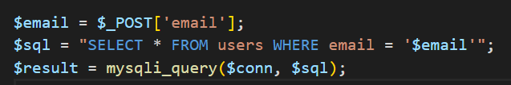

# Blok 7

Welkom terug.

Wij gaan verder met het project tools4ever. Je hebt tot dusver de volgende technieken toegepast met betrekking tot Create Read Update Delete (CRUD): create en read.

**Create**

Met een POST-formulier kun je data *bevragen* aan de gebruiker. Daarbij controleer je de ingevoerde data om uiteindelijk met INSERT INTO data op te slaan in de database.

**Read**

Met SELECT-query vraag je data op door gebruik te maken van een GET request en associatieve arrays kun je dynamisch data tonen op het scherm.

We gaan het project uitbreiden met Delete en Update.

**Delete**

De delete query gebruiken we om een enkele rij uit de database te verwijderen op basis van de primary key van diezelfde rij. We gebruiken hiervoor een GET-request. Dit werkt bijna hetzelfde als het benaderen van een detail-pagina.

**Update**

Met de Update query kunnen we bestaande records (rijen) wijzigen/updaten naar de correcte informatie. Hiervoor gebruiken we ten eerste een GET-request in combinatie met een SELECT WHERE statement om de juiste data op te halen (detail-pagina-techiek). En ten tweede gebruiken we een POST-request in combiniatie met de UPDATE WHERE query om het gewenste resultaat te behalen.

In de vorige twee periodes hebben we gebruik gemaakt van eenvoudige functies om de queries uit te voeren. Echter zijn deze functies niet veilig genoeg. Deze manier van coderen met PHP kan leiden tot SQL-injecties met grote negatieve gevolgen. Dit jaar introduceren we een andere wijze van connectie maken met de database en daardoor een iets andere schrijfwijze. We gaan gebruik maken van een object binnen php genaamd pdo.

Om het probleem met sql injecties te demonstreren volgt hieronder een korte toelichting

## SQL Injections

Je hebt in het vorige blok geleerd om een sql statement in een variabele te zetten en deze variabele aan de functie mysqli_query() mee te geven:

Daarnaast heb je ook geleerd om een variabele te plaatsen in de string als je bijvoorbeeld 1 gebruiker wilt ophalen:

Een variabele direct plaatsen in een sql-statement is *gevaarlijk.* Het kan namelijk misbruikt worden door een andere expert. Hij/zij kan namelijk de gegevens zo aanpassen dat er andere gegevens opgehaald worden of verwijderd. Of zelfs de gehele database kan verwijderd worden. Dit noemen ze ook wel SQL-Injections. Het injecteren van sql. Eerst volgt nu een uitleg over hoe je een sql-injection uitvoert. En daarna hoe je je code zo aanpast dat het niet meer mogelijk is, met behulp van *prepared statements*

Probeer maar eens met een van je eerder gemaakte projecten waarin een inlog-functionaliteit gebouwd is…

Een van de volgende waardes in te vullen in het email scherm:

| ' or 1=1;\# | " or ""=" | " or ""=" |
|-------------|-----------|-----------|

Als je dat gedaan hebt dan wordt je sql-statement als volgt:

Wat staat er nu eigenlijk? Alles van een de gebruikers tabel selecteren waar het email adres leeg is OF waar 1 gelijk is aan 1. En dat is TRUE dus…. Inloggen maar!!!

Dit doe je dus allemaal op de client side, in het formulier. Dit betekent dat ook andere mensen dit kunnen uitvoeren. Dus een onveilige applicatie.

Om dit te voorkomen dien je gebruik te maken van prepared statements.

## SQL prepared statements

Met prepared statements stoppen we geen variabelen in een string. We werken met tijdelijke placeholders.

### Database Conenctie

Maar eerst maken we een database connectie. Dit gaat op een andere wijze, we maken nu gebruik van PDO (een ander type databaseconnectie):

Zie jet \$conn = new PDO staat?

Daarna kunnen we de \$conn variabele gebruiken om queries uit te voeren op de database.

Maar dit gaat nu wel in iets meer stappen.

Stel we hebben een hotel site die gasten opslaat in de database. We maken dus gebruik van een HTML-formulier. We halen data op met POST en gaan die gebruiken om de data op te slaan.

### Prepare SQL

In onderstaande code willen we een hotelgast opslaan, daarvoor gebruiken we INSERT INTO. Maar nu stoppen we geen variabelen bij VALUES maar placeholders. Let op de dubbele punten. Tevens gebruiken we de Prepare methode. Kortom, we bereiden de query eerst voor, voordat deze naar de database gestuurd wordt.

### Bind Params

De placeholders worden een moment later gekoppeld via een methode bindParam() aan variabelen:

### Execute

En dan pas kunnen we de query uitvoeren op de database:

Vanaf nu gebruiken we alleen nog maar prepared statements om data op te halen, op te slaan, te verwerken en de verwijderen.

## Delete

Vorige blokken heb je een deel van CRUD gemaakt. Create Read Update Delete, weet je nog?

We hebben Read gedaan en Create. Daarvoor gebruikte we SQL met SELECT en INSERT INTO. Nu gaan we DELETEN en Updaten

Deleten werkt nagenoeg hetzelfde als het bekijken van een detailpagina. We maken gebruik een GET-request om het juiste record (rij) uit de database te verwijderen. Kijk hieronder maar eens naar de verschillen en overeenkomsten:

We vragen dus een tools_delete.php op met een GET-request. En op basis van het tool_id gaan we een tool uit de database verwijderen.

Dan moet die pagina natuurlijk wel bestaan anders krijgen we een 404 error.

De delete pagina bevat een klein beetje code, met prepared statements dus.

## Update

Rollen

Update en delete

Prepared statements

1-op-veel relatie

Blok 8

Veel-op-veel

OOP
